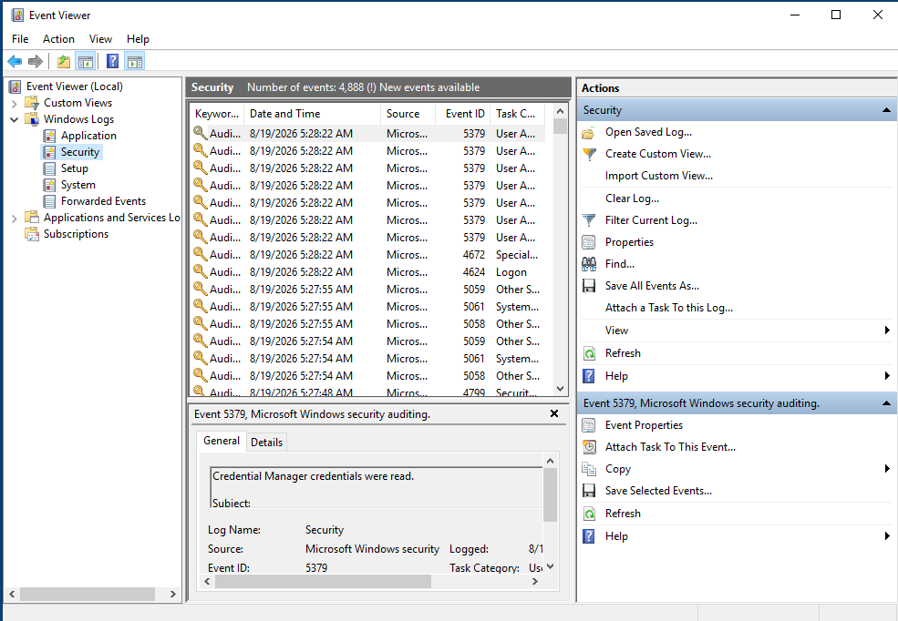
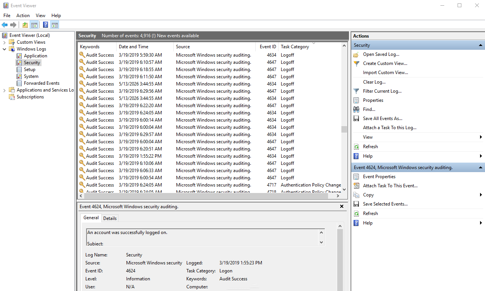
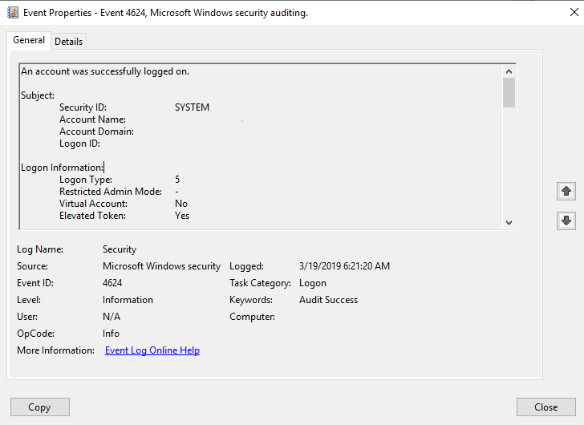
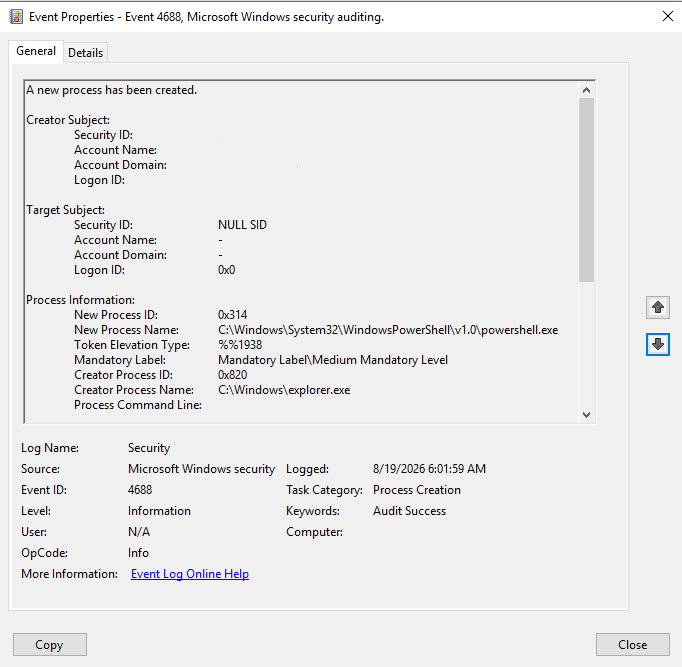

# Windows 10 Digital Forensics Investigation

## Overview

This project is a hands-on Windows 10 digital forensics investigation performed in an isolated VMware virtual machine.

The objective was to simulate a basic forensic investigation by generating controlled user activity, collecting Windows forensic artifacts, analysing them with Windows Event Viewer and Autopsy, and documenting the findings.

The investigation focuses on:

- Windows authentication events
- Process creation
- PowerShell activity
- File-system metadata
- Deleted-file artifacts
- Windows shortcut artifacts
- ShellBags
- Program execution artifacts
- Evidence correlation and timeline analysis
- 
## Lab Environment

| Component |	Details |
|---|---|
| Operating System | Windows 10 |
| Virtualization | VMware |
| Forensic Tool |	Autopsy |
| Log Analysis | Windows Event Viewer |
| Evidence Source |	Windows 10 virtual disk image (.vmdk) |
| Analysis Environment | Isolated virtual machine |

## Investigation Objectives

The investigation was designed to answer the following questions:

Can a Windows interactive logon be identified?
Can executed processes be identified from Windows event logs?
Can PowerShell execution be identified?
Can the relationship between PowerShell and its parent process be examined?
Can files be recovered and examined from a forensic disk image?
Can file metadata and cryptographic hashes be recovered?
Can deleted-file artifacts be identified?
Can Windows user-activity artifacts such as ShellBags and shortcut files be recovered?
Can multiple forensic artifacts be correlated into a timeline?

## Methodology

The investigation followed these general stages:

1. Created an isolated Windows 10 VMware environment.
2. Generated controlled user and process activity.
3. Examined Windows Security Event Logs.
4. Identified authentication and process-creation events.
5. Examined PowerShell operational logging.
6. Created and examined a test file named suspicious_file.txt.
7. Created a forensic copy of the VMware disk.
8. Loaded the copied .vmdk into Autopsy.
9. Analysed the Windows file system and forensic artifacts.
10. Recorded timestamps, hashes, and other metadata.
11. Correlated findings from multiple evidence sources.
12. Documented observations and limitations.
    
## Windows Event Log Analysis

### Event ID 4624 — Interactive Logon

An Event ID 4624 was identified with:

**Logon Type:** 2 — Interactive

**Timestamp:** 19 August 2026, 05:19:25

This indicates that an interactive logon was recorded on the Windows 10 system.

### Event ID 4688 — PowerShell

An Event ID 4688 was identified for:

C:\Windows\System32\WindowsPowerShell\v1.0\powershell.exe

**Timestamp:** 19 August 2026, 06:02:59

The event also identified:

**Creator Process:** C:\Windows\explorer.exe'

This provides process-creation evidence showing that PowerShell was launched by Windows Explorer.

### Event ID 4688 — Notepad

An Event ID 4688 was identified for:

C:\Windows\System32\notepad.exe

Timestamp: 19 August 2026, 06:08:15

This demonstrates that Notepad execution was recorded by Windows process-creation auditing.

## PowerShell Operational Logging

PowerShell Operational logging was examined using Event Viewer.

### PowerShell Artifact Details

### Powershell Creator Process 

### Event ID 4103 

An Event ID 4103 was identified containing:

'CommandInvocation(Add-Type): "Add-Type"'

This demonstrates that PowerShell operational logging captured a command invocation.

The Add-Type command was not interpreted as malicious by itself. The artifact was documented as an observed PowerShell command rather than evidence of malicious activity.

An Event ID 4104 search was also performed. No event containing the specific test-file terms was identified.

## Autopsy Analysis

A copied Windows 10 VMware disk image was loaded into Autopsy for forensic analysis.

The original VMware disk was preserved while the copied image was used for analysis.

### File-System Evidence

Autopsy identified the Windows file system and the following user profile:

Users\IEUser

The investigation located:

Desktop\Forensics Project\suspicious_file.txt

### File Metadata

Autopsy recovered the following metadata for suspicious_file.txt:

| Metadata	| Value |
|---|---|
| Created |	2026-08-19 14:06:13 BST |
| Modified| 	2026-08-19 13:26:02 BST |
| Accessed| 	2026-08-19 14:06:13 BST |
|Changed | 	2026-08-19 13:26:02 BST |
| MD5 |	Recovered by Autopsy |
| SHA-256 |	Recovered by Autopsy |

The file timestamps were not treated as proof of a specific user action. The difference between creation/access timestamps and modification/change timestamps was recorded as an observation requiring contextual interpretation.

## Recovered Windows Artifacts

### Run Programs

Autopsy identified program execution artifacts for:

\Windows\System32\notepad.exe
\Windows\System32\WindowsPowerShell\v1.0\powershell.exe

These artifacts provide independent evidence supporting the Windows Event Log process-creation findings.

### Recent Documents

Autopsy recovered Windows shortcut artifacts associated with:

- 'Forensics Project.lnk'
- 'suspicious_file.txt.lnk'
- 'investigation-notes.txt.lnk

Windows .lnk artifacts can provide information about files and folders that were accessed or referenced by the system.

### ShellBags

ShellBag artifacts were recovered showing Windows Explorer folder activity.

The investigation examined ShellBag metadata including:

- Path
- Registry key
- Last Write
- Modified
- Created
- Accessed
- Data Source
  
### Recycle Bin

The Windows Recycle Bin artifact was examined for evidence of deleted files.

This demonstrates the use of Autopsy to investigate deleted-file artifacts within a forensic disk image.

## Investigation Timeline

| Date/Time| 	Source |	Finding |
| 19 Aug 2026 05:19:25 |	Security Event 4624 |	Interactive logon |
| 19 Aug 2026 06:02:59 |	Security Event 4688 |	PowerShell execution |
| 19 Aug 2026 06:08:15 |	Security Event 4688 |	Notepad execution |
| 19 Aug 2026 13:26:02 |	Autopsy |	File modified/metadata changed |
| 19 Aug 2026 14:06:13 |	Autopsy |	File created/accessed |

The timestamps from different forensic artifacts were compared without assuming that one artifact alone establishes causation.

## Key Findings

### Finding 1 — Interactive Logon

A Windows interactive logon was identified through Event ID 4624 with Logon Type 2.

### Finding 2 — PowerShell Execution

PowerShell execution was identified through Event ID 4688.

The associated creator process was recorded as:

C:\Windows\explorer.exe

### Finding 3 — Notepad Execution

Notepad execution was identified through Event ID 4688.

### Finding 4 — PowerShell Operational Activity

Event ID 4103 recorded a PowerShell Add-Type command invocation.

No conclusion was made that this activity was malicious.

### Finding 5 — File-System Evidence

Autopsy recovered suspicious_file.txt from the Windows file system and provided detailed file metadata and cryptographic hashes.

### Finding 6 — Corroborating Evidence

Autopsy's Run Programs artifact independently identified both PowerShell and Notepad, supporting the process-creation findings from Windows Event Logs.

### Finding 7 — Windows User Activity

Recent Documents and ShellBag artifacts provided additional evidence of Windows user interaction with project-related files and folders.

## Limitations

This was a controlled laboratory investigation rather than a real-world incident response case.

Important limitations include:

- The activity was deliberately generated for testing.
- The environment was a virtual machine.
- Some Windows artifacts may not have been enabled or captured.
- PowerShell Event ID 4104 did not contain the specific test-file commands searched for.
- File timestamps were interpreted cautiously because timestamps alone do not establish user intent.
- The investigation does not establish malicious activity.
  
## Lessons Learned

This project provided hands-on experience with:

- Windows Security Event Logs
- Event ID 4624
- Logon Types
- Event ID 4688
- Process creation analysis
- Parent/creator process analysis
- PowerShell Operational logging
- Event ID 4103
- Windows file-system analysis
- File metadata
- MD5 and SHA-256 hashing
- Recycle Bin artifacts
- ShellBags
- Windows .lnk artifacts
- Autopsy
- Evidence preservation
- Timeline construction
- Evidence correlation
- Forensic documentation

## Conclusion

This investigation demonstrated a basic end-to-end Windows forensic workflow using an isolated Windows 10 virtual machine.

Multiple independent forensic artifacts were examined and correlated, including Windows Security Event Logs, PowerShell Operational logs, file-system metadata, Run Programs, Recent Documents, ShellBags, and Recycle Bin artifacts.

The project demonstrates practical experience with Windows forensic investigation and evidence analysis while maintaining a distinction between observed evidence and unsupported conclusions.

## Evidence Screenshots

Screenshots documenting the investigation are available in the screenshots directory.
